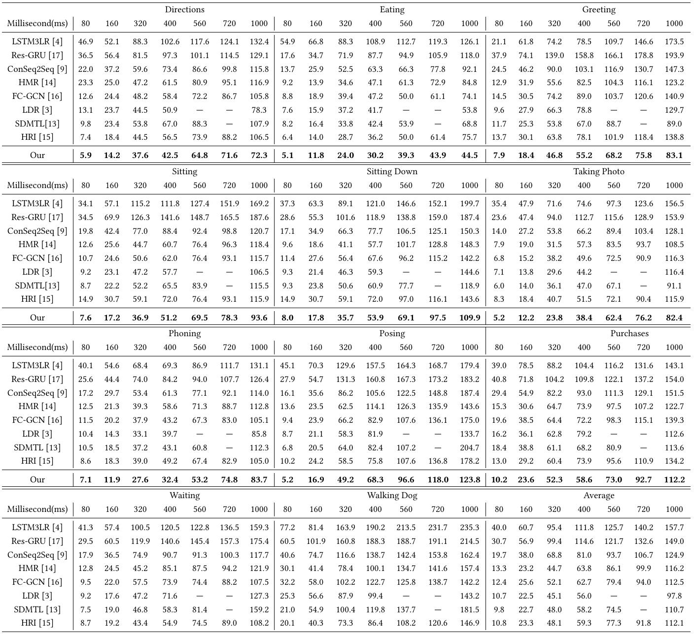
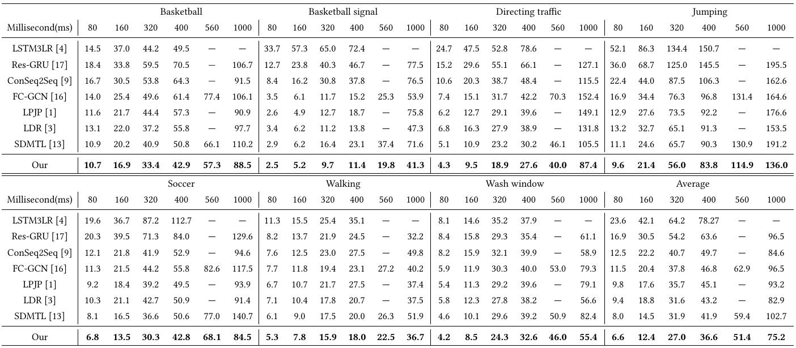
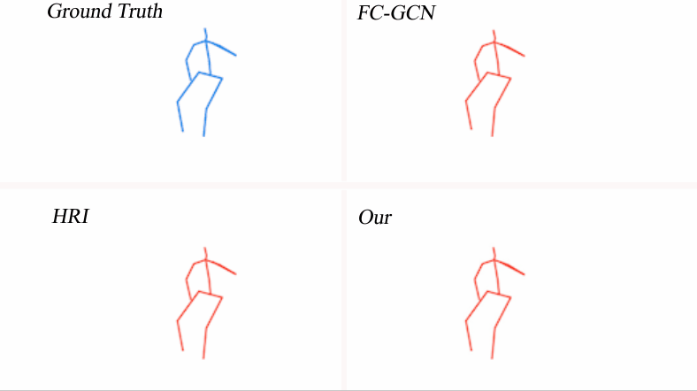
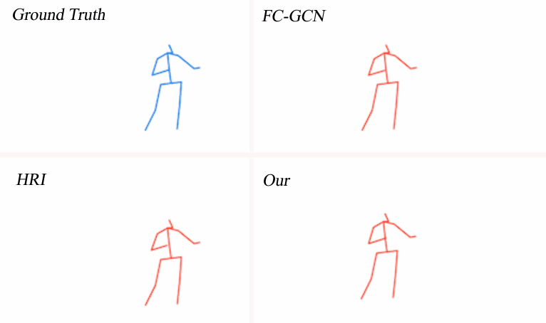
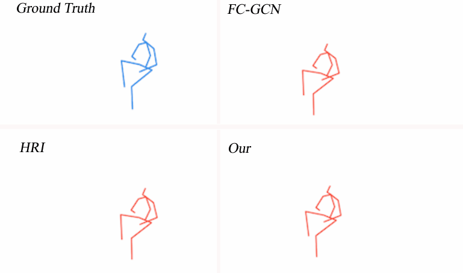

# TEID: A New State-of-the-art Approach for Future Motion Prediction

## Introduction
 Motion prediction is a classic problem in computer vision, which is at the core of many applications such as autonomous driving, human-machine interaction, and animation. Various deep learning models have been proposed, achieving state-of-the-art performance on motion prediction. However, existing methods typically focus on modeling temporal dynamics in the pose space. The complicated and high dimensionality nature of pose invokes inherent difficulties for motion context modeling. Therefore, we move away from the conventional pose based representation and present a novel approach employing a phase space trajectory representation of individual joints. Moreover, current methods tend to consider only the dependencies between skeletal connected joints. In this paper, we introduce a novel convolutional neural model to effectively leverage prior knowledge of motion anatomy, and simultaneously capture both spatial and temporal information of joint trajectory dynamics. We then propose a global optimization module that learns the implicit relationships between individual joint features.
Empirically, our method is evaluated on 4 benchmark datasets from 3 species (i.e., human, fish, and mouse). Surprisingly, our method sets the new state-of-the-art on all the 4 benchmark datasets with a 27.8% accuracy improvement in average. Our code is released (anonymized) at https://github.com/MM-424/TEID to facilitate reproduction of our work and to inspire researchers. 

## Dataset

Several skeleton data from  Human3.6m , CMU-Mocap, Fish and Mouse datasets have been used for training our method:

Human 3.6m: http://vision.imar.ro/human3.6m/description.php

CMU-Mocap: https://github.com/chaneyddtt/Convolutional-Sequence-to-Sequence-Model-for-Human-Dynamics

Fish and Mouse: https://github.com/BII-wushuang/Lie-Group-Motion-Prediction


## Motion Prediction
The main file is [main.py](code/main.py)

**Train**

To train and predict on default setting, execute the following commands with python 3.

```
python main.py
python close_prediction.py
```

The default action in the model is "eating".  You can also change the model to train and predict for another action, simply by setting different  "keyword" in [preprocess.py](code/prepocess/preprocess.py). 

 The list of available actions in Human3.6m is:

```
["Directions", "Eating", "Greeting", "Sitting", "Sitting Down",
 "Taking Photo", "Phoning", "Posing", "Purchases", "Waiting",
 "Walking Dog"]
```

 The list of available actions in CMU Mocap dataset is:

```
["Basketball", "Basketball signal", "Directing traffic", "Jumping", 
 "Sitting Down", "Soccer", "Walking", "Wash window"]
```

**Visualize**

To visualize the predicted results, run:

```
python vis_modle.py
```

 Visualization results  are saved in:
```
./prepocess/
```

## Results

### **Prediction Quantitative Results**

#### H3.6M

 

#### CMU

 

### **Prediction Visual Results**

#### Eating

 

####  Directions

 

#### Sitting



#### Walking Dog


